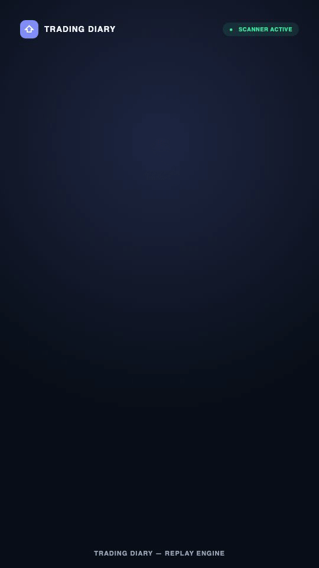
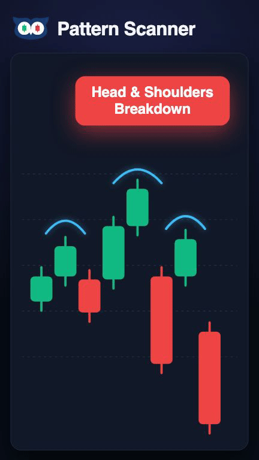

# Trading Diary

An intraday trade logging, analytics, automated scanner, and trade replay platform built with Next.js and Drizzle ORM.

<p center="true">
  
  
</p>

## Quick Start

```bash
# Install dependencies
npm install

# Run dev server
npm run dev

# Run Remotion studio for promo videos
npm run video:studio
```

Open [http://localhost:3000](http://localhost:3000) to view the application.

## Packages (Workspaces)

- [`packages/ai-connect`](packages/ai-connect): AI provider management & trade review engine (`@reactkits.dev/ai-connect`).
- [`packages/react-engage`](packages/react-engage): User feedback, announcements, and support widget (`@reactkits.dev/react-engage`).
- [`packages/better-auth-connect`](packages/better-auth-connect): Authentication integration helpers (`@reactkits.dev/better-auth-connect`).
- [`packages/react-media-library`](packages/react-media-library): Embedded asset and screenshot manager (`@reactkits.dev/react-media-library`).

## Production IBKR Gateway

```bash
# Tunnel to production gateway GUI
ssh -i ~/.ssh/id_rsa -N -L 5900:127.0.0.1:5900 root@5.223.53.140

# Restart gateway container if needed
ssh -i ~/.ssh/id_rsa root@5.223.53.140 'cd /srv/tradingdiary && docker compose -p tradingdiary-ibkr -f docker-compose.ibkr.server.yml restart ib-gateway'
```

Open `vnc://localhost:5900` to complete gateway 2FA authentication. See [`docs/specs/hybrid-futures-provider-setup.md`](docs/specs/hybrid-futures-provider-setup.md) for full setup details.
